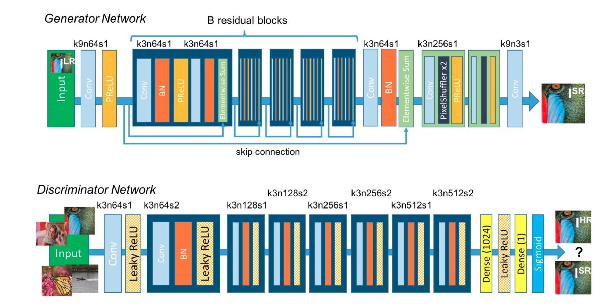
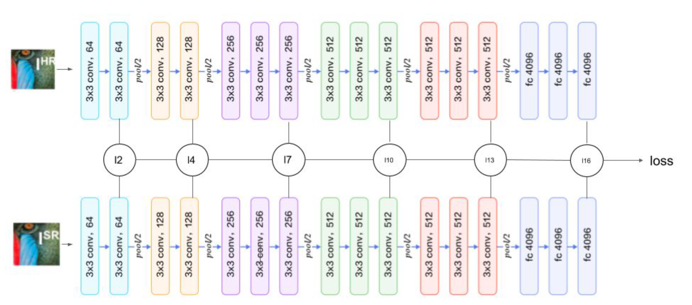

# SRGAN with Multi-Layer VGG Perceptual Loss

PyTorch implementation of a Super-Resolution Generative Adversarial Network (SRGAN) for single-image super-resolution.

This project investigates whether a **weighted multi-layer VGG16 perceptual loss** can improve the perceptual quality of SRGAN-generated images compared with the conventional single-layer perceptual loss.

## Overview

The project implements SRGAN with:

- Residual blocks in the generator
- Adversarial training
- VGG16-based perceptual loss
- Weighted multi-layer VGG16 perceptual loss
- Bicubic upscaling as a baseline
- PSNR and SSIM evaluation
- Training and validation visualization

The main experiment compares three approaches:

1. Bicubic upscaling
2. SRGAN with single-layer VGG perceptual loss
3. SRGAN with multi-layer VGG perceptual loss

The multi-layer approach extracts features from multiple VGG16 layers and combines them using weighted perceptual loss.

## Research Question

**Can the perceptual quality of SRGAN be improved by using a weighted multi-layer VGG16 perceptual loss?**

## Dataset

The model is trained and evaluated using the **DIV2K** dataset.

- Dataset: DIV2K
- Super-resolution scale: 4×
- Framework: PyTorch

## Model

### SRGAN

The SRGAN architecture consists of:

- Generator network with residual blocks
- Upsampling layers
- Discriminator network
- Adversarial training

The generator produces a high-resolution image from a low-resolution input, while the discriminator attempts to distinguish generated images from real high-resolution images.

### Multi-Layer VGG Perceptual Loss

Instead of relying on a single VGG16 feature layer, the proposed approach compares the generated and ground-truth images at multiple VGG16 feature levels.

The selected VGG16 layers capture features at different levels of abstraction, allowing the perceptual loss to consider both lower-level visual details and higher-level semantic features.

The multi-layer perceptual loss is combined with the adversarial and reconstruction losses during training.


## Architecture

The model is based on the SRGAN architecture, consisting of a generator
and discriminator trained adversarially.

The main modification investigated in this project is a weighted multi-layer
VGG16 perceptual loss, which compares feature representations at multiple
VGG16 layers.



### Multi-Layer VGG16 Perceptual Loss




## Results

### Quantitative Results

Two example images were used to compare bicubic upscaling, single-layer SRGAN, and multi-layer SRGAN.

| Image | Method | PSNR (dB) | SSIM |
|---|---|---:|---:|
| Comic Girl | Bicubic | 20.25 | 0.59 |
| Comic Girl | Single-layer SRGAN | 20.34 | 0.62 |
| Comic Girl | Multi-layer SRGAN | **21.00** | **0.66** |
| Baboon | Bicubic | 19.76 | 0.38 |
| Baboon | Single-layer SRGAN | 19.27 | 0.41 |
| Baboon | Multi-layer SRGAN | 19.41 | 0.41 |

The multi-layer model achieved the best PSNR and SSIM on the comic-girl example. On the baboon example, the multi-layer model improved PSNR over the single-layer model while maintaining the same SSIM.

More importantly, visual inspection showed that the multi-layer model produced perceptually improved super-resolution images compared with the single-layer approach.

### Visual Comparison


## Training

Install the required dependencies:

```bash
pip install -r requirements.txt
